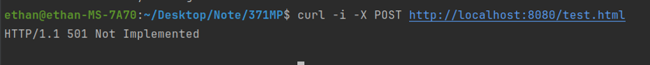

# 371 Mini Project 1

## **Step one: Determine Requirements**

### `200 OK`:

**Description**: The request was successful, and the server returned the requested resource. The request must be valid, well-formed, and target a file that exists on the server.

**Method**: GET

**Test**: Use a valid GET request with an existing HTML to trigger the response.

**Request Message**:

``` http
GET /test.html HTTP/1.1
Host: localhost
```


### `304 Not Modified`:

**Description**: The requested resource has not been modified since the date specified in the If-Modified-Since header. The request must include an If-Modified-Since header with a timestamp. The server checks the last modified time of the requested resource. If it hasn’t been modified since that time, it returns 304 Not Modified.

**Method**: GET

**Test**: Use a GET request with the If-Modified-Since header and specify a time after the file's last modification.

**Request Message:**

```http
GET /test.html HTTP/1.1
Host: localhost
If-Modified-Since: Wed, 16 Oct 2024 07:28:00 GMT
```


### `400 Bad Request`

**Description**: The server cannot understand the request due to malformed syntax. The request must be improperly formatted, missing required components, or contain invalid syntax. This could happen if the request line or headers are incorrect.

**Method**: Any HTTP method can result in a 400 error if the syntax is invalid.

**Test**: Use an invalid or incomplete HTTP request to trigger a 400 Bad Request.

**Request Message:**

```http
GET /test.html HTTP/1.1
Host: localhost
```

 

### `404 Not Found`

**Description**: The server could not find the requested resource. The request must target a resource that does not exist on the server.

**Method**: GET

**Test**: Use a valid GET request for a non-existent file.

**Request Message:**

``` http
GET /test404.html HTTP/1.1
Host: localhost
```


### `501 Not Implemented`

**Description**: The server does not support the functionality required to fulfill the request.

The request must use an HTTP method that the server does not support (for example, POST, PUT, DELETE, etc.).

**Test**: Use an unsupported HTTP method such as POST to trigger the 501 Not Implemented response.

**Request Message:**

``` http
POST /test.html HTTP/1.1
Host: localhost
```


## Step 2

### 200 Response:


### 304 Response:


### 400 Response:


### 404 Response:


### 501 Response:




## Step 3

A web server directly serves its own files or resources to a client, while a proxy server acts as an intermediary between the client and another server. It relays the client’s request to the target server and returns the response.

### Detailed Specifications

* Listening for Client Requests
* Parsing the Request
* Forwarding Requests
* Handling HTTPS Requests (`https` via CONNECT)
* Error Handling
* Connection Lifecycle and Concurrency
  * Implement a timeout mechanism and a decision mechanism that allows the application to either wait for a response or close the connection.
  * Handle multiple client connections


### Test Procedure

* Visit http with `GET`:
  * `curl -x localhost:8081 http://127.0.0.1:3000/test.html  `
  * Receive the html file
  
  
  
* Visit https with `CONNECT`:
  
  * `curl -x localhost:8081 https://www.google.com `
  * Receive the html file
  
* See more information:
  * `curl -i -x localhost:8081 https://www.google.com`
  * It is worth to say that the first `200 ok` comes from proxy server and the second `200 ok` comes form target server. Both of them is necessary.

### Multi-thread

* Pro :
  * Thread Creation for Each Client
  * Requesting simultaneously

* Improvement:
  * Increased Throughput
  * Multiple clients
  * Reduced Latency
* Test Procedure
  * Using `ab` (Apache Benchmark)
    * `ab -n 100 -c 5 http://localhost:8080/test.html`
    * Result:

## Part 4

We’ve made changes to our web server to send data in chunks instead of in a single request to avoid the HOL problem using frames.

* We set chunk_size as 512 and add `Transfer-Encoding: chunked` into our `response_headers`

  

* The decision to implement this feature on the web server side is due to the server's role in sending data.

* We also offer a flag `is_chunck` to control whether the server enables this feature.

  ```python
  if __name__ == "__main__":
      is_chunck = False # enable feature by turning this flag to True
      server_process = multiprocessing.Process(target=start_server, args=('localhost', 8080, is_chunck))
      proxy_process = multiprocessing.Process(target=start_proxy_server, args=('localhost', 8081))
      server_process.start()
      proxy_process.start()  
      server_process.join()
      proxy_process.join()
  ```

